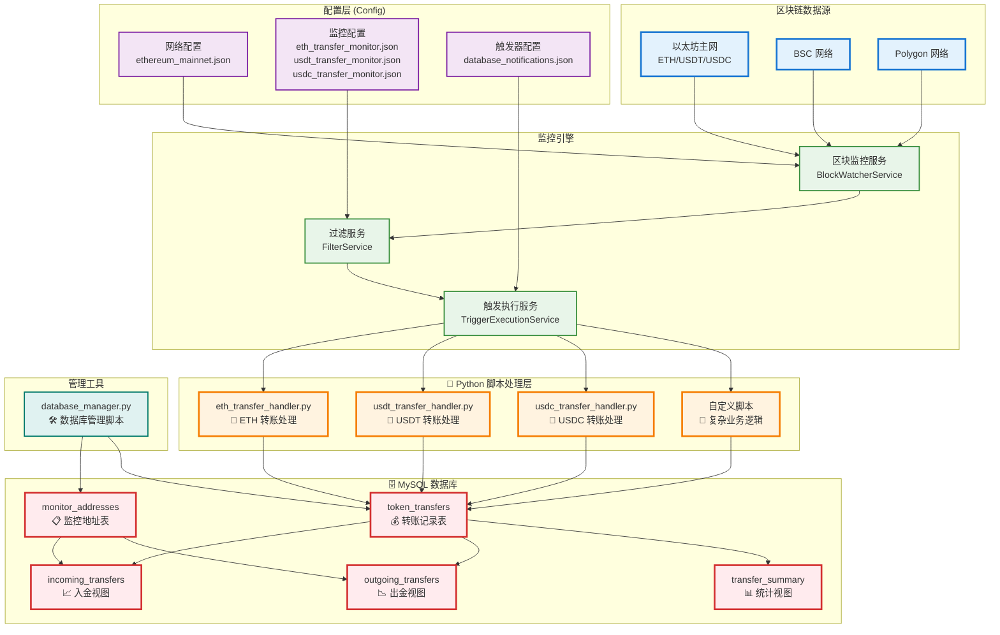

# Molly ETH Monitor - 区块链监控系统

> 基于openzeppelin开源系统的，专注于数据库集成和 Python 脚本驱动的ETH 区块链监控系统，实现链上数据的智能采集与自动化处理

## 🎯 系统简介

Molly ETH Monitor 是一个以**数据库存储**和 **Python 脚本处理**为核心的区块链监控平台。系统通过灵活的配置文件管理，将区块链事件数据自动存储到 MySQL 数据库，并通过 Python 脚本实现复杂的数据处理逻辑，为企业级应用提供完整的数据管道解决方案。

## ✨ 核心特性

### 🗄️ **强大的数据库支持** 
- **MySQL 原生集成**: 内置 MySQL 连接池和自动重连机制
- **智能表结构**: 自动创建和管理监控地址表、转账记录表
- **数据视图支持**: 预置入金/出金/统计视图，便于数据分析
- **完整的管理工具**: Python 数据库管理脚本，支持地址管理和数据查询

### 🐍 **Python 脚本驱动**
- **多语言触发器**: 支持 Python、JavaScript、Shell 脚本
- **实时数据处理**: 监控匹配时自动触发 Python 脚本处理
- **灵活的参数传递**: JSON 格式数据传递，支持复杂数据结构
- **异步执行**: 基于 Tokio 的异步脚本执行，支持超时控制

### 🔧 **配置驱动的架构**
- **JSON 配置文件**: 网络、监控器、触发器完全配置化
- **热重载支持**: 配置文件修改后无需重启服务
- **多网络支持**: EVM 兼容链和 Stellar 网络
- **灵活的过滤条件**: 基于表达式的智能事件过滤

## 🏗️ 技术栈

### 核心技术
- **后端语言**: Rust (1.84+)
- **异步运行时**: Tokio
- **Web 框架**: Actix-Web
- **区块链交互**: Alloy (EVM), Stellar SDK
- **数据库**: 支持多种数据库后端
- **消息队列**: 内置任务调度器

### 监控技术
- **指标收集**: Prometheus
- **可视化**: Grafana
- **日志系统**: Tracing + 结构化日志
- **配置管理**: JSON/YAML 配置文件

### 部署技术
- **容器化**: Docker + Docker Compose
- **编排**: 支持 Kubernetes
- **CI/CD**: GitHub Actions
- **文档**: Antora 静态站点生成

## 🏛️ 数据库与脚本驱动架构



## 🚀 快速开始

### 环境要求

- **Rust**: 1.84 或更高版本
- **Docker**: 20.10 或更高版本
- **Docker Compose**: 2.0 或更高版本
- **内存**: 最少 2GB，推荐 4GB
- **磁盘**: 最少 10GB 可用空间

### 1. 克隆项目

```bash
git clone https://github.com/your-org/molly-eth-monitor.git
cd molly-eth-monitor
```

### 2. 环境配置

```bash
# 复制环境变量模板
cp env.example .env

# 编辑环境变量
vim .env
```

### 3. 配置网络和监控

```bash
# 配置网络 (以以太坊为例)
cp examples/config/networks/ethereum_mainnet.json config/networks/

# 配置监控器
cp examples/config/monitors/evm_transfer_usdc.json config/monitors/

# 配置触发器
cp examples/config/triggers/discord_notifications.json config/triggers/
```

### 4. 启动服务

#### 使用 Docker Compose (推荐)

```bash
# 启动基础监控服务
docker-compose up -d

# 启动包含监控指标的完整服务
docker-compose --profile metrics up -d
```

#### 本地开发模式

```bash
# 构建项目
cargo build --release

# 运行服务
cargo run --release

# 或使用便捷脚本
./setup_and_run.sh
```

### 5. 验证部署

```bash
# 检查服务状态
docker-compose ps

# 查看日志
docker-compose logs -f monitor

# 访问 Grafana 仪表板 (如果启用了 metrics profile)
open http://localhost:3000
```

## 🧩 核心组件

### 1. 🗄️ MySQL 数据库集成

系统内置完整的 MySQL 数据库支持，实现链上数据的持久化存储：

#### 数据库表结构

```sql
-- 监控地址表 - 管理需要监控的钱包地址
CREATE TABLE monitor_addresses (
    id BIGINT AUTO_INCREMENT PRIMARY KEY,
    address VARCHAR(42) NOT NULL UNIQUE,
    token_type VARCHAR(10) NOT NULL,
    description TEXT,
    is_active BOOLEAN DEFAULT TRUE,
    created_at TIMESTAMP DEFAULT CURRENT_TIMESTAMP
);

-- 转账记录表 - 存储所有转账事件
CREATE TABLE token_transfers (
    id BIGINT AUTO_INCREMENT PRIMARY KEY,
    tx_hash VARCHAR(66) NOT NULL,
    from_address VARCHAR(42) NOT NULL,
    to_address VARCHAR(42) NOT NULL,
    value VARCHAR(255) NOT NULL,
    token_type VARCHAR(10) NOT NULL,
    block_number BIGINT NOT NULL,
    timestamp TIMESTAMP NOT NULL,
    gas_used VARCHAR(255),
    gas_price VARCHAR(255),
    status VARCHAR(20) NOT NULL
);
```

#### 智能数据视图

```sql
-- 入金记录视图
CREATE VIEW incoming_transfers AS
SELECT *, 'INCOMING' as transfer_type
FROM token_transfers 
WHERE to_address IN (SELECT address FROM monitor_addresses WHERE is_active = TRUE);

-- 出金记录视图  
CREATE VIEW outgoing_transfers AS
SELECT *, 'OUTGOING' as transfer_type
FROM token_transfers 
WHERE from_address IN (SELECT address FROM monitor_addresses WHERE is_active = TRUE);

-- 统计视图
CREATE VIEW transfer_summary AS
SELECT token_type, DATE(timestamp) as transfer_date,
       COUNT(*) as total_transfers,
       SUM(CASE WHEN to_address IN (...) THEN CAST(value AS DECIMAL(65,0)) ELSE 0 END) as total_incoming_value
FROM token_transfers GROUP BY token_type, DATE(timestamp);
```

### 2. 🐍 Python 脚本处理系统

基于 Tokio 异步运行时的多语言脚本执行引擎，重点支持 Python 脚本：

#### Python 脚本执行器

```rust
// Rust 端脚本执行逻辑
pub struct PythonScriptExecutor {
    pub script_content: String,
}

impl ScriptExecutor for PythonScriptExecutor {
    async fn execute(&self, input: MonitorMatch, timeout_ms: &u32) -> Result<bool> {
        let cmd = tokio::process::Command::new("python3")
            .arg("-c")
            .arg(&self.script_content)
            .stdin(Stdio::piped())
            .stdout(Stdio::piped())
            .stderr(Stdio::piped())
            .spawn()?;
        // 异步执行并处理结果
    }
}
```

#### Python 脚本示例

```python
#!/usr/bin/env python3
import json
import mysql.connector
import os
import logging
from datetime import datetime

def connect_database():
    """连接 MySQL 数据库"""
    return mysql.connector.connect(
        host=os.getenv("DB_HOST", "localhost"),
        port=int(os.getenv("DB_PORT", "3306")),
        user=os.getenv("DB_USER", "root"),
        password=os.getenv("DB_PASSWORD", ""),
        database=os.getenv("DB_NAME", "blockchain_monitor"),
        charset='utf8mb4',
        autocommit=True,
        pool_size=5
    )

def process_transfer_event(event_data):
    """处理转账事件并存储到数据库"""
    conn = connect_database()
    cursor = conn.cursor()
    
    # 解析事件数据
    receipt = event_data['EVM']['receipt']
    tx_hash = receipt['transactionHash']
    block_number = int(receipt['blockNumber'], 16)
    
    # 解析转账信息
    for log in receipt['logs']:
        if log['topics'][0] == '0xddf252ad1be2c89b69c2b068fc378daa952ba7f163c4a11628f55a4df523b3ef':
            from_address = '0x' + log['topics'][1][-40:]
            to_address = '0x' + log['topics'][2][-40:]
            value = str(int(log['data'], 16))
            
            # 插入数据库
            insert_query = """
                INSERT INTO token_transfers 
                (tx_hash, from_address, to_address, value, token_type, block_number, timestamp, status)
                VALUES (%s, %s, %s, %s, %s, %s, %s, %s)
            """
            cursor.execute(insert_query, (
                tx_hash, from_address, to_address, value, 
                'USDT', block_number, datetime.now(), 'SUCCESS'
            ))
            
            logging.info(f"成功存储转账记录: {tx_hash}")
    
    cursor.close()
    conn.close()

if __name__ == "__main__":
    # 从标准输入读取事件数据
    event_data = json.loads(input())
    process_transfer_event(event_data)
```

### 3. 📋 配置文件管理

系统采用 JSON 配置文件驱动，实现完全的配置化管理：

#### 触发器配置

```json
{
  "eth_transfer_database": {
    "name": "ETH Transfer Database Handler",
    "trigger_type": "script",
    "config": {
      "language": "Python",
      "script_path": "./config/triggers/scripts/eth_transfer_handler.py",
      "arguments": ["--verbose"],
      "timeout_ms": 5000
    }
  },
  "usdt_transfer_database": {
    "name": "USDT Transfer Database Handler", 
    "trigger_type": "script",
    "config": {
      "language": "Python",
      "script_path": "./config/triggers/scripts/usdt_transfer_handler.py",
      "timeout_ms": 5000
    }
  }
}
```

#### 监控器配置

```json
{
  "name": "USDT Transfer Monitor",
  "networks": ["ethereum_mainnet"],
  "conditions": {
    "events": [
      {
        "signature": "Transfer(address,address,uint256)",
        "contract_address": "0xdAC17F958D2ee523a2206206994597C13D831ec7",
        "expression": "args.value > 0"
      }
    ]
  },
  "actions": ["usdt_transfer_database"]
}
```

### 4. 🛠️ 数据库管理工具

提供完整的 Python 数据库管理脚本：

```bash
# 添加监控地址
python3 scripts/database_manager.py add 0x1234... USDT "交易所热钱包"

# 查询转账记录
python3 scripts/database_manager.py transfers --days 7 --token USDT

# 查看统计信息
python3 scripts/database_manager.py summary --days 30

# 列出所有监控地址
python3 scripts/database_manager.py list
```

## ⚡ 性能优化

### 1. 客户端池优化

```rust
// 配置多个 RPC 节点实现负载均衡
{
  "rpc_urls": [
    {
      "url": "https://eth.drpc.org",
      "weight": 100
    },
    {
      "url": "https://ethereum.publicnode.com",
      "weight": 80
    }
  ]
}
```

### 2. 批量处理优化

- **区块批量获取**: 减少 RPC 调用次数
- **事件批量过滤**: 提高过滤效率
- **通知批量发送**: 降低网络开销

### 3. 内存管理

- **智能缓存**: LRU 缓存常用数据
- **内存池**: 复用对象减少分配
- **流式处理**: 大数据量流式处理

### 4. 并发优化

```toml
# Cargo.toml 性能配置
[profile.release]
opt-level = 3
lto = true
codegen-units = 1
panic = "abort"
```

## 🚀 部署指南

### Docker 生产部署

#### 1. 准备配置文件

```bash
# 创建配置目录
mkdir -p /opt/molly-monitor/{config,data,logs}

# 复制配置文件
cp -r config/* /opt/molly-monitor/config/
```

#### 2. 生产环境变量

```bash
# /opt/molly-monitor/.env
LOG_LEVEL=info
LOG_MODE=file
LOG_MAX_SIZE=1073741824
METRICS_ENABLED=true
METRICS_PORT=8081
MONITOR_DATA_DIR=/opt/molly-monitor/data
LOG_DATA_DIR=/opt/molly-monitor/logs
```

#### 3. Docker Compose 生产配置

```yaml
# docker-compose.prod.yml
version: '3.8'
services:
  monitor:
    image: openzeppelin/openzeppelin-monitor:latest
    restart: always
    environment:
      - LOG_LEVEL=info
      - METRICS_ENABLED=true
    volumes:
      - /opt/molly-monitor/config:/app/config:ro
      - /opt/molly-monitor/data:/app/data
      - /opt/molly-monitor/logs:/app/logs
    networks:
      - monitor-network
    deploy:
      resources:
        limits:
          memory: 2G
          cpus: '1.0'
        reservations:
          memory: 1G
          cpus: '0.5'
```

### Kubernetes 部署

#### 1. 配置 ConfigMap

```yaml
# k8s-configmap.yaml
apiVersion: v1
kind: ConfigMap
metadata:
  name: monitor-config
data:
  ethereum_mainnet.json: |
    {
      "network_type": "EVM",
      "slug": "ethereum_mainnet",
      "rpc_urls": [...]
    }
```

#### 2. 部署 Deployment

```yaml
# k8s-deployment.yaml
apiVersion: apps/v1
kind: Deployment
metadata:
  name: molly-monitor
spec:
  replicas: 2
  selector:
    matchLabels:
      app: molly-monitor
  template:
    metadata:
      labels:
        app: molly-monitor
    spec:
      containers:
      - name: monitor
        image: openzeppelin/openzeppelin-monitor:latest
        resources:
          requests:
            memory: "1Gi"
            cpu: "500m"
          limits:
            memory: "2Gi"
            cpu: "1000m"
        volumeMounts:
        - name: config
          mountPath: /app/config
          readOnly: true
      volumes:
      - name: config
        configMap:
          name: monitor-config
```

### 高可用部署

#### 1. 多实例部署

```bash
# 使用不同的数据目录部署多个实例
docker-compose -f docker-compose.ha.yml up -d
```

#### 2. 负载均衡配置

```nginx
# nginx.conf
upstream monitor_backend {
    server monitor1:8081;
    server monitor2:8081;
    server monitor3:8081;
}

server {
    listen 80;
    location /metrics {
        proxy_pass http://monitor_backend;
    }
}
```

### 监控和告警

#### 1. Prometheus 配置

```yaml
# prometheus.yml
global:
  scrape_interval: 15s

scrape_configs:
  - job_name: 'molly-monitor'
    static_configs:
      - targets: ['monitor:8081']
    scrape_interval: 10s
    metrics_path: /metrics
```

#### 2. Grafana 仪表板

系统提供预配置的 Grafana 仪表板，包含：

- 区块处理速度
- 内存和 CPU 使用率
- 网络连接状态
- 错误率统计
- 通知发送统计

#### 3. 告警规则

```yaml
# alert-rules.yml
groups:
  - name: monitor.rules
    rules:
      - alert: MonitorDown
        expr: up{job="molly-monitor"} == 0
        for: 1m
        labels:
          severity: critical
        annotations:
          summary: "Monitor instance is down"
```

## 📋 数据库与脚本配置详解

### 🗄️ 数据库环境配置

#### 环境变量设置

```bash
# .env 文件配置
DB_HOST=localhost
DB_PORT=3306
DB_USER=root
DB_PASSWORD=your_password
DB_NAME=blockchain_monitor

# 连接池配置
DB_POOL_SIZE=5
DB_POOL_NAME=monitor_pool
DB_CHARSET=utf8mb4
```

#### 数据库初始化脚本

```sql
-- scripts/database_setup.sql
CREATE DATABASE IF NOT EXISTS blockchain_monitor CHARACTER SET utf8mb4 COLLATE utf8mb4_unicode_ci;

USE blockchain_monitor;

-- 监控地址表
CREATE TABLE IF NOT EXISTS monitor_addresses (
    id BIGINT AUTO_INCREMENT PRIMARY KEY,
    address VARCHAR(42) NOT NULL UNIQUE,
    token_type VARCHAR(10) NOT NULL,
    description TEXT,
    is_active BOOLEAN DEFAULT TRUE,
    created_at TIMESTAMP DEFAULT CURRENT_TIMESTAMP,
    updated_at TIMESTAMP DEFAULT CURRENT_TIMESTAMP ON UPDATE CURRENT_TIMESTAMP,
    INDEX idx_address (address),
    INDEX idx_token_type (token_type),
    INDEX idx_is_active (is_active)
) ENGINE=InnoDB DEFAULT CHARSET=utf8mb4;

-- 转账记录表
CREATE TABLE IF NOT EXISTS token_transfers (
    id BIGINT AUTO_INCREMENT PRIMARY KEY,
    tx_hash VARCHAR(66) NOT NULL,
    from_address VARCHAR(42) NOT NULL,
    to_address VARCHAR(42) NOT NULL,
    value VARCHAR(255) NOT NULL,
    token_type VARCHAR(10) NOT NULL,
    block_number BIGINT NOT NULL,
    timestamp TIMESTAMP NOT NULL,
    gas_used VARCHAR(255),
    gas_price VARCHAR(255),
    status VARCHAR(20) NOT NULL,
    created_at TIMESTAMP DEFAULT CURRENT_TIMESTAMP,
    INDEX idx_tx_hash (tx_hash),
    INDEX idx_from_address (from_address),
    INDEX idx_to_address (to_address),
    INDEX idx_token_type (token_type),
    INDEX idx_timestamp (timestamp)
) ENGINE=InnoDB DEFAULT CHARSET=utf8mb4;
```

### 🐍 Python 脚本配置

#### 触发器配置文件

```json
// config/triggers/database_notifications.json
{
  "eth_transfer_database": {
    "name": "ETH Transfer Database Handler",
    "trigger_type": "script",
    "config": {
      "language": "Python",
      "script_path": "./config/triggers/scripts/eth_transfer_handler.py",
      "arguments": ["--verbose"],
      "timeout_ms": 5000
    }
  },
  "usdt_transfer_database": {
    "name": "USDT Transfer Database Handler",
    "trigger_type": "script", 
    "config": {
      "language": "Python",
      "script_path": "./config/triggers/scripts/usdt_transfer_handler.py",
      "arguments": ["--debug"],
      "timeout_ms": 5000
    }
  },
  "usdc_transfer_database": {
    "name": "USDC Transfer Database Handler",
    "trigger_type": "script",
    "config": {
      "language": "Python", 
      "script_path": "./config/triggers/scripts/usdc_transfer_handler.py",
      "timeout_ms": 5000
    }
  }
}
```

#### Python 脚本模板

```python
# config/triggers/scripts/usdt_transfer_handler.py
#!/usr/bin/env python3
"""
USDT 转账事件处理脚本
自动解析转账事件并存储到 MySQL 数据库
"""

import json
import sys
import os
import logging
import mysql.connector
from datetime import datetime, timezone

# 配置日志
logging.basicConfig(level=logging.INFO, format='%(asctime)s - %(levelname)s - %(message)s')
logger = logging.getLogger(__name__)

def get_env(key, default_value):
    """获取环境变量"""
    return os.getenv(key, default_value)

def connect_database():
    """连接数据库"""
    logger = logging.getLogger(__name__)
    db_host = get_env("DB_HOST", "localhost")
    db_port = int(get_env("DB_PORT", "3306"))
    db_user = get_env("DB_USER", "root")
    db_password = get_env("DB_PASSWORD", "")
    db_name = get_env("DB_NAME", "blockchain_monitor")
    
    try:
        conn = mysql.connector.connect(
            host=db_host,
            port=db_port,
            user=db_user,
            password=db_password,
            database=db_name,
            charset='utf8mb4',
            autocommit=True,
            pool_size=5,
            pool_name="monitor_pool",
            pool_reset_session=True
        )
        logger.info(f"成功连接到数据库: {db_host}:{db_port}/{db_name}")
        return conn
    except mysql.connector.Error as err:
        logger.error(f"数据库连接失败: {err}")
        return None

def process_usdt_transfer(match_data):
    """处理 USDT 转账事件"""
    conn = connect_database()
    if not conn:
        return False
    
    try:
        cursor = conn.cursor()
        
        # 解析监控匹配数据
        evm_data = match_data.get('EVM', {})
        receipt = evm_data.get('receipt', {})
        
        tx_hash = receipt.get('transactionHash', '')
        block_number = int(receipt.get('blockNumber', '0x0'), 16)
        
        # 解析转账日志
        for log in receipt.get('logs', []):
            topics = log.get('topics', [])
            if len(topics) >= 3 and topics[0] == '0xddf252ad1be2c89b69c2b068fc378daa952ba7f163c4a11628f55a4df523b3ef':
                # Transfer 事件签名
                from_address = '0x' + topics[1][-40:]
                to_address = '0x' + topics[2][-40:]
                value = str(int(log.get('data', '0x0'), 16))
                
                # 插入数据库
                insert_query = """
                    INSERT IGNORE INTO token_transfers 
                    (tx_hash, from_address, to_address, value, token_type, block_number, timestamp, status)
                    VALUES (%s, %s, %s, %s, %s, %s, %s, %s)
                """
                
                cursor.execute(insert_query, (
                    tx_hash,
                    from_address.lower(),
                    to_address.lower(), 
                    value,
                    'USDT',
                    block_number,
                    datetime.now(timezone.utc),
                    'SUCCESS'
                ))
                
                logger.info(f"USDT转账记录已存储: {tx_hash} | {from_address} -> {to_address} | {value}")
        
        cursor.close()
        return True
        
    except Exception as e:
        logger.error(f"处理USDT转账事件时发生错误: {e}")
        return False
    finally:
        if conn:
            conn.close()

def main():
    """主函数"""
    try:
        # 从标准输入读取监控匹配数据
        input_data = sys.stdin.read().strip()
        if not input_data:
            logger.error("未收到输入数据")
            sys.exit(1)
        
        # 解析JSON数据
        match_data = json.loads(input_data)
        
        # 处理USDT转账
        success = process_usdt_transfer(match_data)
        
        if success:
            logger.info("USDT转账事件处理完成")
            sys.exit(0)
        else:
            logger.error("USDT转账事件处理失败")
            sys.exit(1)
            
    except json.JSONDecodeError as e:
        logger.error(f"JSON解析失败: {e}")
        sys.exit(1)
    except Exception as e:
        logger.error(f"脚本执行失败: {e}")
        sys.exit(1)

if __name__ == "__main__":
    main()
```

### 🔧 监控器配置

#### USDT 转账监控配置

```json
// config/monitors/usdt_transfer_monitor.json
{
  "name": "USDT Transfer Monitor",
  "networks": ["ethereum_mainnet"],
  "conditions": {
    "events": [
      {
        "signature": "Transfer(address,address,uint256)",
        "contract_address": "0xdAC17F958D2ee523a2206206994597C13D831ec7",
        "expression": "args.value > 0"
      }
    ]
  },
  "actions": ["usdt_transfer_database"],
  "paused": false
}
```

#### ETH 主币监控配置

```json
// config/monitors/eth_transfer_monitor.json
{
  "name": "ETH Transfer Monitor", 
  "networks": ["ethereum_mainnet"],
  "conditions": {
    "transactions": [
      {
        "expression": "tx.value > 0 && tx.status == 'success'"
      }
    ]
  },
  "actions": ["eth_transfer_database"],
  "paused": false
}
```

## 🔧 开发指南

### 本地开发环境

```bash
# 安装 Rust 工具链
curl --proto '=https' --tlsv1.2 -sSf https://sh.rustup.rs | sh

# 克隆项目
git clone https://github.com/your-org/molly-eth-monitor.git
cd molly-eth-monitor

# 安装依赖
cargo build

# 运行测试
cargo test

# 运行开发服务器
cargo run
```

### 添加新的区块链支持

1. **实现客户端接口**:
```rust
// src/services/blockchain/clients/mychain/client.rs
#[async_trait]
impl BlockchainClient for MyChainClient {
    async fn get_latest_block_number(&self) -> Result<u64>;
    async fn get_block(&self, number: u64) -> Result<Block>;
    // ... 其他方法
}
```

2. **添加数据模型**:
```rust
// src/models/blockchain/mychain/
pub struct MyChainBlock { ... }
pub struct MyChainTransaction { ... }
```

3. **实现过滤器**:
```rust
// src/services/filter/filters/mychain/
pub struct MyChainFilter { ... }
```

### 添加新的通知渠道

```rust
// src/services/notification/myservice.rs
#[async_trait]
impl NotificationChannel for MyService {
    async fn send(&self, message: &NotificationMessage) -> Result<()> {
        // 实现发送逻辑
    }
}
```

### 测试

```bash
# 运行单元测试
cargo test

# 运行集成测试
cargo test --test integration

# 运行属性测试
cargo test --test properties

# 生成测试覆盖率报告
cargo llvm-cov --html
```

## 📚 API 文档

### 指标端点

```bash
# 获取 Prometheus 指标
curl http://localhost:8081/metrics

# 健康检查
curl http://localhost:8081/health

# 系统信息
curl http://localhost:8081/info
```

### 配置验证

```bash
# 验证配置文件
./openzeppelin-monitor --check

# 测试特定监控器
./openzeppelin-monitor --monitor-path config/monitors/test.json --network ethereum_mainnet --block 18000000
```

## 🤝 贡献指南

我们欢迎社区贡献！请遵循以下步骤：

1. **Fork 项目**
2. **创建功能分支**: `git checkout -b feature/amazing-feature`
3. **提交更改**: `git commit -m 'Add amazing feature'`
4. **推送分支**: `git push origin feature/amazing-feature`
5. **创建 Pull Request**

### 开发规范

- 遵循 Rust 官方代码风格
- 编写单元测试和集成测试
- 更新相关文档
- 遵循语义化版本控制

## 📄 许可证

本项目采用 [GNU Affero General Public License v3.0](LICENSE) 许可证。


## 🙏 致谢

感谢以下开源项目和贡献者：

- [OpenZeppelin](https://openzeppelin.com/) - 智能合约安全框架
- [Alloy](https://github.com/alloy-rs/alloy) - Rust 以太坊库
- [Tokio](https://tokio.rs/) - 异步运行时
- [Actix](https://actix.rs/) - Web 框架

---

<div align="center">
  <strong>🚀 开始您的区块链监控之旅吧！</strong>
</div>
